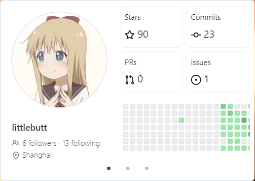
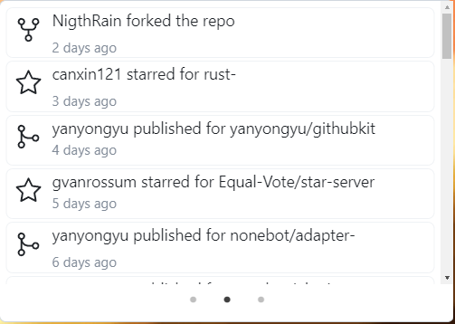
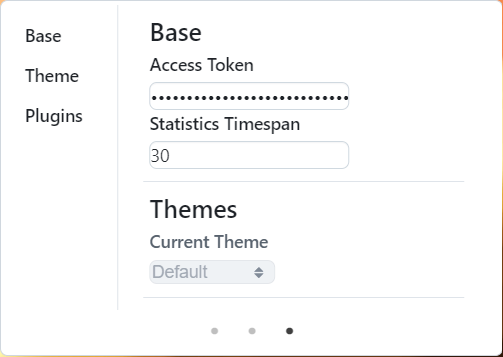

# Github Panel: A desktop tray for Github

## Introduction

Github Panel is a cross-platform, high-efficient and user-friendly desktop tray for Github. Currently, the panel includes three pages: personal information page, personal events page and settings page. The detailed content is as followed:

### Personal Information Page



All your personal basic information includes:

- Avatar
- Login name
- Followers and followings
- Location (if provided)
- Stars earned, commits, pull requests and issues
- Activities in the recent one year

### Personal Events Page



The events showed in your homepage include:

- Event type
- Event actor
- Event action and time
- Event repo

### Settings Page



The basic settings include:

- Your Github Access Token
- The time range for the information provided in personal events page
- Themes and Plugins (support soon)

## Quick Start

1. Apply your [Github Access Token](https://docs.github.com/en/authentication/keeping-your-account-and-data-secure/managing-your-personal-access-tokens) if you don't have one

2. Add your Github Access Token to the settings page

3. Save and relaunch the app

Or, you can edit the config in your home directory: `~/gh-panel.toml` or `~/.config/gh-panel.toml`. It is generated automatically if you have launched the app once.

The sample config file is as followed:

```
accessToken = "<YOUR TOKEN>"
timespan = "30"

[theme/default]
activate = true

[theme/dark]
activate = false

```

## Themes

Support soon

## Plugins

Support soon


